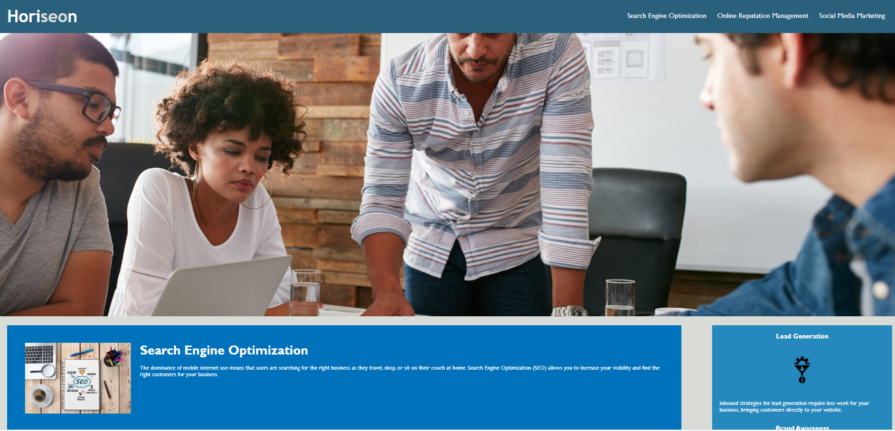
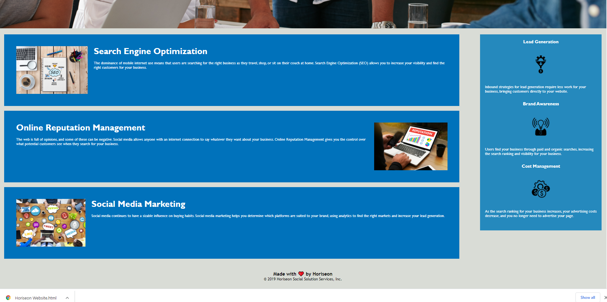

# Horiseon Code Refactor

## Description

- the goal of this assignment was to add semantic HTML elements, add comments , and compress the style.css file.

## Editor

- Visual Studio Code (VS Code)

## Completed Task

- ALT text added to images
- CSS style sheet is compressed as much as possible
- HTML elements replaced with semantic elements
- Descriptive title added
- Added meta tag on the header with a description of the website

# Final Product

